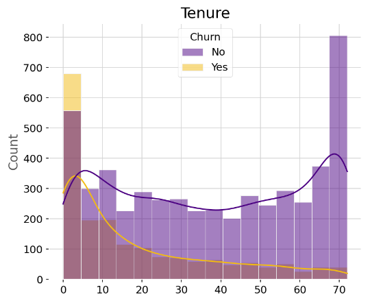
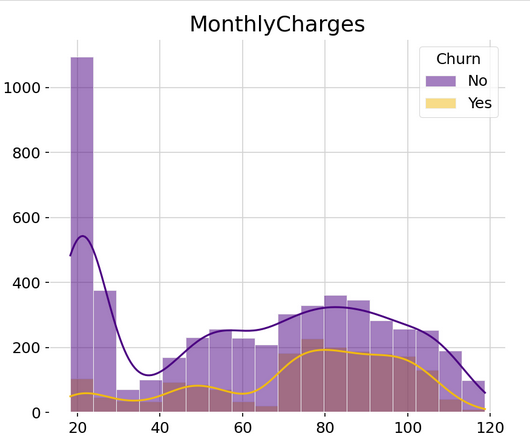
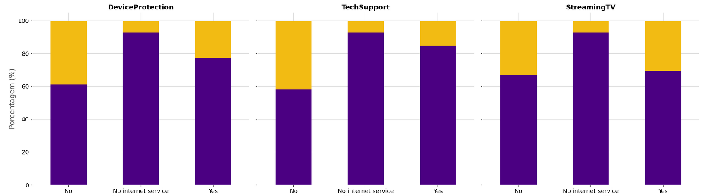

#### Em desenvolvimento
# Telecom Churn Prediction

# 1. Description
* Este é um projeto de ciência de dados de ponta a ponta (end-to-end) que utiliza algoritmos de Machine Learning para prever a probabilidade de um cliente cancelar os serviços de uma empresa de telecomunicações (Churn). O projeto aborda um problema de aprendizado supervisionado para classificação binária, onde o objetivo é identificar clientes de alto risco (Target = 1) antes que a evasão ocorra.
* A implementação seguiu rigorosas etapas de análise e engenharia. Inicialmente, foi realizada uma Análise Exploratória de Dados (EDA) profunda para identificar os principais churn drivers, como tipo de contrato, tecnologia de internet e tempo de casa (tenure).
* Para aproximar o projeto de um fluxo de trabalho real de mercado, a solução foi estruturada de forma modular. O desenvolvimento foi dividido em componentes responsáveis por:
Ingestão e Limpeza: Tratamento de dados ausentes e correção de tipos.
Engenharia de Atributos (Feature Engineering): Transformação de variáveis categóricas via Encoding e normalização de variáveis numéricas.
Treinamento e Avaliação: Pipeline automatizado para testes de diferentes algoritmos (como Random Forest ou XGBoost) e otimização de hiperparâmetros.
* O projeto foi desenvolvido utilizando boas práticas de programação, incluindo o uso de ambientes virtuais para isolamento de dependências, tratamento de exceções, e geração de logs para monitoramento. O objetivo final é entregar não apenas um modelo, mas um sistema escalável que possa ser consumido por outras áreas de negócio para estratégias de retenção proativa.

# 2. Technologies and Tools
Python, Pandas, NumPy, Matplotlib, Seaborn, Scikit-learn, Jupyter Notebook / Google Colab

# 3. Business problem and project objective

### 3.1 Qual é o problema do negócio?
  Uma empresa de telecomunicações apresenta uma taxa considerável de rotatividade de clientes. Atualmente, diversos consumidores estão trocando os serviços oferecidos pela companhia pelos da concorrência. Seria de grande valor estratégico se a operadora conseguisse prever quais clientes estão em risco de cancelar seus contratos nos próximos meses.

### 3.2 Entendimento do Problema
  A rotatividade de clientes (*Churn Rate*) é um dos maiores desafios no setor de telecomunicações. Mesmo uma taxa de perda de 1% pode significar prejuízos milionários quando aplicada a uma base massiva de usuários.
  
  O objetivo central deste projeto não é apenas calcular o churn, mas antecipá-lo. Buscamos responder: **quais clientes têm alta probabilidade de cancelamento no curto prazo?**
  
  Ao identificar padrões ocultos de comportamento — muitas vezes antes que o próprio cliente tome a decisão consciente de sair — a empresa pode substituir estratégias genéricas por ações de retenção cirúrgicas, focadas exclusivamente nos perfis de alto risco, otimizando o orçamento de marketing e preservando a receita.

### 3.3 Contexto do negócio: KPIs Importantes
  Para entender o impacto financeiro do problema, analisamos os seguintes indicadores de performance (KPIs) de Custo e Eficiência de Aquisição:
  
  * **CAC (Customer Acquisition Cost):** Talvez o mais importante. Mede o total investido em marketing, publicidade, comissões de vendas e sistemas, dividido pelo número de novos clientes conquistados em um determinado período.
  * **LTV (Lifetime Value):** Estima a receita total que um cliente trará para a empresa durante todo o tempo em que permanecer como assinante.
  * **ARPU (Average Revenue Per User):** Avalia o valor médio mensal gerado por cada novo cliente, essencial para calcular o potencial de retorno.
  * **Churn Rate (Taxa de Cancelamento) Inicial:** Monitora se os novos clientes estão cancelando logo após a assinatura, o que pode indicar problemas no processo de vendas.

> **Por que estes KPIs são importantes para Telecom?**
> O mercado de telecomunicações é extremamente competitivo, com altos custos de infraestrutura e aquisição. Monitorar o CAC e o LTV é fundamental para garantir que a empresa não esteja gastando mais para adquirir um cliente do que o valor que ele gera a longo prazo.

### 3.4 Objetivos do Projeto
  * Identificar os principais fatores e variáveis envolvidos no churn.
  * Construir um modelo de Machine Learning capaz de prever quais clientes cancelarão o serviço.
  * Promover insights para ações direcionadas de redução da taxa de churn.

### 3.5 Benefícios do Projeto
  * Retenção de clientes
  * Proteção de receita
  * Serviço personalizado 
  * Marketing Otimizado 
  * Inteligência de Negócio

### 3.6 Conclusão da Abordagem
O objetivo final do projeto é que o modelo preveja a **probabilidade** de um cliente deixar a operadora. Essa abordagem é mais vantajosa do que a classificação binária simples (que indica apenas se o cliente vai ou não sair), pois permite verificar quais clientes têm alta probabilidade de cancelamento e separá-los em grupos (Clusterização de Risco).

Dessa forma, é possível concentrar esforços nos segmentos mais críticos, identificando clientes que precisam apenas de monitoramento, aqueles que exigem ações imediatas e os que não necessitam desse tipo de atenção.

### 4. Solution Pipiline 
Pipiline de resolução usado no projeto(baseado no CRISPIM-DM)

  *  1. Definir o problema de negócio.

  * 2. Coletar os dados e obter uma visão geral deles.

  * 3. Dividir os dados em conjuntos de treino e teste.

  * 4. Explorar os dados (Análise Exploratória de Dados – EDA).

  * 5. Engenharia de atributos, limpeza e pré-processamento dos dados.

  * 6. Treinamento dos modelos, comparação, seleção de atributos e ajuste de hiperparâmetros.

  * 7. Teste final do modelo em produção e avaliação.

  *  8. Conclusão e interpretação dos resultados do modelo.

  *  9. Implantação (deploy).

## 5. Main Business Insights

Nesta etapa, consolidamos as descobertas mais relevantes da Análise Exploratória de Dados (EDA), focando nos fatores que mais influenciam a evasão de clientes.

### 1. O Perfil de Risco: Novos Clientes e Contratos Mensais
A análise revelou que o Churn não é distribuído de forma uniforme, existindo um "período crítico" de retenção logo após a adesão.

* **Tenure (Tempo de Casa):** Apresenta uma correlação negativa moderada de **-0.35** com o Churn. Isso indica que clientes com menos tempo de casa são estatisticamente mais propensos a sair.
  > 
> *Figura 1: Gráficos de dispersão mostrando a concentração de Churn (em vermelho) em clientes com baixo Tenure.*

* **Tipo de Contrato:** Clientes com contratos mês a mês (**Month-to-month**) possuem uma taxa de evasão drasticamente superior aos de contratos anuais, sendo o principal preditor de rotatividade.

---

### 2. O Paradoxo da Tecnologia e Preço
Embora a tecnologia de Fibra Óptica ofereça velocidades superiores, ela é um dos principais vetores de cancelamento no cenário atual.

* **Fibra Óptica:** Usuários desta tecnologia apresentam taxas de Churn mais elevadas, possivelmente devido ao alto ticket médio (**Monthly Charges**).
* **Custo Mensal:** Existe uma correlação positiva de **0.20** entre o valor da fatura e o cancelamento. Clientes que pagam faturas mais caras, especialmente no início do relacionamento, representam o grupo de maior risco.

> 
> 
> *Figura 2: Dispersão de MonthlyCharges evidenciando a sensibilidade ao preço no grupo de Churn.*

---

### 3. Fatores de Fidelização (Âncoras de Retenção)
Identificamos serviços que funcionam como barreiras de saída, reduzindo significativamente a probabilidade de um cliente abandonar a empresa.

* **Suporte Técnico e Segurança:** Clientes que utilizam **TechSupport** e **DeviceProtection** apresentam taxas de Churn significativamente menores em comparação aos que não possuem esses serviços.
* **Dependência Familiar:** Clientes com parceiros e dependentes tendem a ser mais estáveis, apresentando menor incidência de cancelamento.
* **Neutralidade do Streaming:** Serviços como **StreamingTV** e **StreamingMovies** não impactam drasticamente a probabilidade de Churn, funcionando mais como conveniência do que como âncora de fidelidade.

> 
> *Figura 3: Comparativo do impacto de serviços de valor agregado na retenção.*

---

### 4. Atrito em Pagamentos e Público Sênior
Determinados comportamentos de faturamento e perfis demográficos exigem atenção estratégica imediata.

* **Método de Pagamento:** O pagamento via **Electronic Check** apresenta a maior taxa de evasão entre todas as formas de pagamento disponíveis.
* **Senior Citizens:** A taxa de evasão entre idosos é quase o dobro da média da base, sugerindo possíveis dificuldades com acessibilidade ou falta de planos adequados a esse perfil.

> 
> *Figura 4: Proporção elevada de Churn no segmento SeniorCitizen.*

